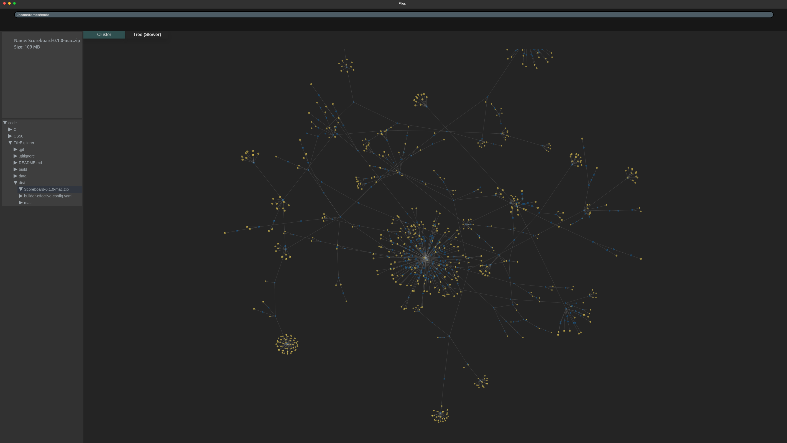

# FileExplorer

Simple ongoing file explorer project to play around with [React](https://reactjs.org/) + [Electron](https://www.electronjs.org/). This is not under "active" development.

## Prerequisites

[NodeJS](https://nodejs.org/en/)

## Getting started

To get started with a development build of the application download the source code and restore the packages with 

    npm install 

You can run a development version of the application with

    npm run electron-dev

## Distribution

The distribution of the application is controlled by the packager [Electron Build](https://www.electron.build/). Configuration of the builder can be found in the `electron-builder.yml` file.

In order to package the app for redistribution you can run

    npm run electron-pack

